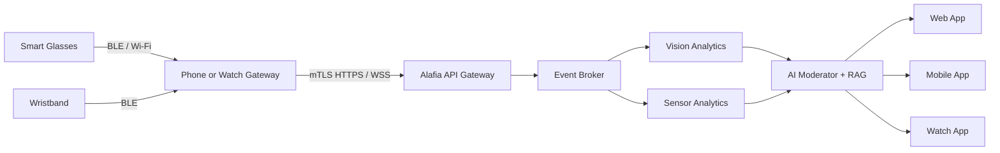
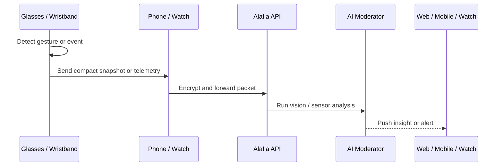

# Hardware Upgrade and Alafia Integration Plan

This document consolidates the wearable-to-Alafia design into a more complete reference that combines narrative explanations, architecture diagrams, payload examples, and PostgreSQL implementation details.

## Executive Summary

The proposed system links smart glasses and wristband-style devices to the Alafia platform so that food intake, medication events, and excretion signals can be captured, processed, and delivered back to users through web, mobile, and smartwatch experiences. The guiding principle is to keep the wearable side lightweight and power-efficient while moving the heavier analysis to a secure backend pipeline.

## 1. System Architecture

Wearables act as edge sensors that detect relevant moments, capture short bursts of data, and hand off the information to a gateway device. From there, the data is encrypted and sent to Alafia services for inference, storage, and notification delivery.



## 2. Hardware Edge Layer

On the wearable itself, the goal is to avoid continuous video streaming and heavy computation. Instead, the device uses local inference or gesture detection to decide when a meaningful event has occurred. Once triggered, it captures a short image, a brief sensor window, or a small telemetry packet and forwards it for cloud-side processing.

This approach improves privacy, reduces battery drain, and keeps the device responsive. Lightweight hardware such as Lattice FPGA-based sensing blocks or small low-power SoCs can run simple trigger logic locally before handing off data.



## 3. Secure Ingestion and Gateway Layer

The gateway layer is the bridge between the wearable and the Alafia platform. It packages the event into a structured payload, applies encryption, and sends it through authenticated channels. In production, mTLS over HTTPS or secure WebSockets should be used to protect patient data and reduce interception risk.

### Example ingestion payload

```json
{
  "device_id": "ALAFIA-WEAR-99x7",
  "patient_id": "usr_8832aef912",
  "timestamp": "2026-06-24T08:44:00Z",
  "trigger_source": "HAND_GESTURE_ACCEL",
  "payload_type": "MEDICATION_IMAGE_BASE64",
  "data": "base64-image-bytes"
}
```

## 4. AI and Nutrition Inference Pipeline

The backend can use a combination of computer vision, recipe inference, and nutrition knowledge retrieval to estimate what a user consumed. A food image alone cannot reveal the complete nutrient profile, so the system should combine visual features with either a user-selected recipe or an imputed recipe generated by a model.

The pipeline typically follows four steps:

1. Detect and segment the foods visible in the image.
2. Estimate the portion size or weight from the visual scene.
3. Resolve the likely recipe or ingredient composition.
4. Retrieve nutrition values from a trusted food-composition source and return a micronutrient summary.

### Python example for micronutrient estimation

```python
import torch
from transformers import AutoProcessor, LlavaForConditionalGeneration
from alafia_nutrition_db import query_biomedical_nutrition_rag


def estimate_micronutrients(image_path, user_recipe_selection=None):
    model = LlavaForConditionalGeneration.from_pretrained("llava-hf/llava-1.5-7b-hf")
    processor = AutoProcessor.from_pretrained("llava-hf/llava-1.5-7b-hf")

    prompt = "USER: <image>\nList ingredients and estimated volume in grams. ASSISTANT:"
    inputs = processor(text=prompt, images=image_path, return_tensors="pt")
    output_tokens = model.generate(**inputs, max_new_tokens=200)
    extracted_text = processor.decode(output_tokens[0], skip_special_tokens=True)

    final_recipe_profile = user_recipe_selection or impute_missing_recipe_variables(extracted_text)

    return query_biomedical_nutrition_rag(
        ingredients=final_recipe_profile["ingredients"],
        mass_grams=final_recipe_profile["weights"],
        cooking_method=final_recipe_profile["cooking_style"],
    )
```

## 5. PostgreSQL Data Model

The database should be organized around ingestion events so that each wearable event can be stored once and linked to specialized tables for food, medication, and excretion analysis. This keeps the model normalized while allowing domain-specific data to evolve independently.

### Schema example

```sql
CREATE EXTENSION IF NOT EXISTS "uuid-ossp";

CREATE TYPE device_type_enum AS ENUM ('GLASSES', 'WRISTBAND', 'WATCH', 'MOBILE', 'WEB');
CREATE TYPE trigger_source_enum AS ENUM ('GESTURE_ACCEL', 'CAMERA_VISION', 'MANUAL_USER', 'PROXIMITY_SENSOR');
CREATE TYPE event_type_enum AS ENUM ('FOOD', 'MEDICATION', 'EXCRETION');
CREATE TYPE cooking_style_enum AS ENUM ('RAW', 'BOILED', 'BAKED', 'FRIED', 'STEAMED', 'GRILLED');
CREATE TYPE validation_status_enum AS ENUM ('PENDING_IMPUTATION', 'AI_IMPUTED', 'USER_VERIFIED', 'CLINICIAN_APPROVED');

CREATE TABLE users (
    user_id UUID PRIMARY KEY DEFAULT uuid_generate_v4(),
    email VARCHAR(255) UNIQUE NOT NULL,
    first_name VARCHAR(100) NOT NULL,
    last_name VARCHAR(100) NOT NULL,
    created_at TIMESTAMPTZ DEFAULT CURRENT_TIMESTAMP NOT NULL
);

CREATE TABLE user_devices (
    device_id UUID PRIMARY KEY DEFAULT uuid_generate_v4(),
    user_id UUID NOT NULL REFERENCES users(user_id) ON DELETE CASCADE,
    device_hardware_uuid VARCHAR(128) UNIQUE NOT NULL,
    device_type device_type_enum NOT NULL,
    firmware_version VARCHAR(50) NOT NULL,
    battery_percentage INT CHECK (battery_percentage BETWEEN 0 AND 100),
    last_sync_at TIMESTAMPTZ DEFAULT CURRENT_TIMESTAMP NOT NULL,
    created_at TIMESTAMPTZ DEFAULT CURRENT_TIMESTAMP NOT NULL
);

CREATE TABLE ingestion_events (
    event_id UUID PRIMARY KEY DEFAULT uuid_generate_v4(),
    user_id UUID NOT NULL REFERENCES users(user_id) ON DELETE CASCADE,
    device_id UUID REFERENCES user_devices(device_id) ON DELETE SET NULL,
    event_type event_type_enum NOT NULL,
    trigger_source trigger_source_enum NOT NULL,
    raw_image_url TEXT,
    raw_sensor_telemetry JSONB,
    received_at TIMESTAMPTZ DEFAULT CURRENT_TIMESTAMP NOT NULL
);

CREATE TABLE food_captures (
    food_capture_id UUID PRIMARY KEY DEFAULT uuid_generate_v4(),
    event_id UUID UNIQUE NOT NULL REFERENCES ingestion_events(event_id) ON DELETE CASCADE,
    estimated_weight_grams NUMERIC(8, 2),
    cooking_style cooking_style_enum DEFAULT 'RAW' NOT NULL,
    status validation_status_enum DEFAULT 'PENDING_IMPUTATION' NOT NULL,
    imputed_recipe_json JSONB,
    processed_at TIMESTAMPTZ
);

CREATE TABLE medication_captures (
    medication_capture_id UUID PRIMARY KEY DEFAULT uuid_generate_v4(),
    event_id UUID UNIQUE NOT NULL REFERENCES ingestion_events(event_id) ON DELETE CASCADE,
    detected_pill_name VARCHAR(255),
    verified_dosage_mg NUMERIC(8, 2),
    raw_medication_nutrients JSONB,
    is_interaction_alert_triggered BOOLEAN DEFAULT FALSE NOT NULL,
    interaction_notes TEXT,
    processed_at TIMESTAMPTZ
);
```

### Stored procedure and alert example

```sql
CREATE OR REPLACE PROCEDURE calculate_daily_micronutrient_summary(
    IN p_user_id UUID,
    IN p_target_date DATE,
    OUT pr_summary_json JSONB
)
LANGUAGE plpgsql
AS $$
DECLARE
    v_food_vit_c NUMERIC(10,3);
    v_med_calcium NUMERIC(10,3);
    v_med_vit_d NUMERIC(10,3);
BEGIN
    SELECT COALESCE(SUM(vitamin_c_mg), 0.000)
    INTO v_food_vit_c
    FROM ingestion_events ie
    JOIN food_captures fc ON ie.event_id = fc.event_id
    JOIN micronutrient_logs ml ON fc.food_capture_id = ml.food_capture_id
    WHERE ie.user_id = p_user_id
      AND ie.event_type = 'FOOD'
      AND (ie.received_at AT TIME ZONE 'UTC')::DATE = p_target_date;

    SELECT
        COALESCE(SUM((mc.raw_medication_nutrients->>'calcium_mg')::NUMERIC), 0.000),
        COALESCE(SUM((mc.raw_medication_nutrients->>'vitamin_d_mcg')::NUMERIC), 0.000)
    INTO v_med_calcium, v_med_vit_d
    FROM ingestion_events ie
    JOIN medication_captures mc ON ie.event_id = mc.event_id
    WHERE ie.user_id = p_user_id
      AND ie.event_type = 'MEDICATION'
      AND (ie.received_at AT TIME ZONE 'UTC')::DATE = p_target_date;

    pr_summary_json := jsonb_build_object(
        'dietary_micronutrients', jsonb_build_object('vitamin_c_mg', v_food_vit_c),
        'medication_imputed_nutrients', jsonb_build_object('calcium_mg', v_med_calcium, 'vitamin_d_mcg', v_med_vit_d)
    );
END;
$$;
```

## 6. Omnichannel Delivery and User Experience

Once the analysis is complete, the result should be delivered back to the patient through the application experience that best fits the context. A web dashboard can show detailed trends, a mobile app can provide user-friendly confirmations, and a smartwatch can surface quick alerts or haptics. This creates a closed loop from hardware capture to clinical interpretation and back to the user.

## 7. Implementation Notes

The design is intentionally modular. Wearable-specific logic stays near the edge, secure transport stays in the gateway layer, and inference and storage are concentrated in the Alafia backend. This separation helps the system evolve as hardware, nutrition models, and user experience requirements change over time.
